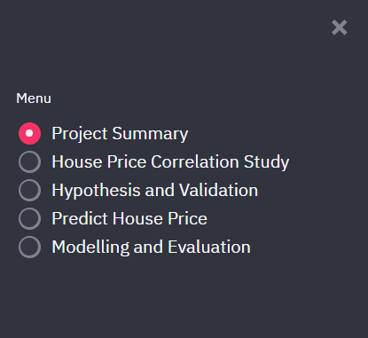
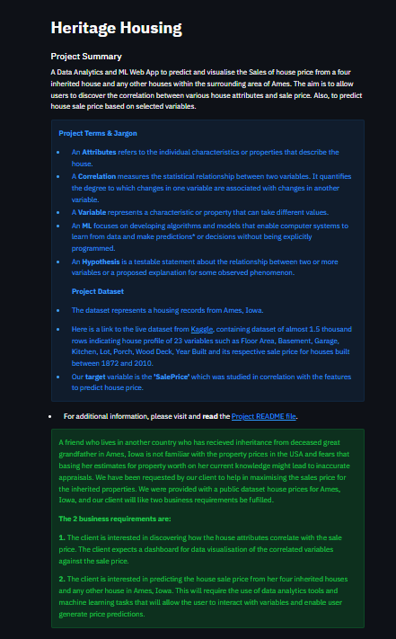

# Heritage Housing Issues

Heritage Housing Issues is a Data Analytics and Machine Learning Web App that predicts house price sales from four inherited houses and any other houses within the surrounding area of Ames. The project has been developed as part of a Portfolio Project of my Predictive Analytics studies, a Project-5 at Code Institute.

Link to deployed App: [Heritage Housing Issues](https://predict-heritage-house-price-23d98fcdef5f.herokuapp.com/)

---

## CONTENTS

- [Dataset](#dataset)
- [Business Requirements](#business-requirements)
- [Rationale to map the business requirements to the Data Visualizations and ML tasks](#rationale-to-map-the-business-requirements-to-the-data-visualizations-and-ml-tasks)
- [ML Business Case](#ml-business-case)
- [Hypothesis and Validation](#hypothesis-and-validation)
- [Dashboard Design](#dashboard-design)
- [Features](#features)
- [Bugs](#bugs)
- [Deployment](#deployment)
- [Main Data Analysis and Machine Learning Libraries](#main-data-analysis-and-machine-learning-libraries)
  - [Languages Used](#languages-used)
  - [Technologies Used](#technologies-used)
  - [Libraries and Packages Used](#libraries-and-packages-used)
- [Credits](#credits)

## Dataset Content

- The dataset is sourced from [Kaggle](https://www.kaggle.com/codeinstitute/housing-prices-data). We then created a fictitious user story where predictive analytics can be applied in a real project in the workplace.
- The dataset has almost 1.5 thousand rows and represents housing records from Ames, Iowa, indicating house profile (Floor Area, Basement, Garage, Kitchen, Lot, Porch, Wood Deck, Year Built) and its respective sale price for houses built between 1872 and 2010.

| Variable      | Meaning                                                                 | Units                                                                                                                                                                   |
| :------------ | :---------------------------------------------------------------------- | :---------------------------------------------------------------------------------------------------------------------------------------------------------------------- |
| 1stFlrSF      | First Floor square feet                                                 | 334 - 4692                                                                                                                                                              |
| 2ndFlrSF      | Second-floor square feet                                                | 0 - 2065                                                                                                                                                                |
| BedroomAbvGr  | Bedrooms above grade (does NOT include basement bedrooms)               | 0 - 8                                                                                                                                                                   |
| BsmtExposure  | Refers to walkout or garden level walls                                 | Gd: Good Exposure; Av: Average Exposure; Mn: Minimum Exposure; No: No Exposure; None: No Basement                                                                       |
| BsmtFinType1  | Rating of basement finished area                                        | GLQ: Good Living Quarters; ALQ: Average Living Quarters; BLQ: Below Average Living Quarters; Rec: Average Rec Room; LwQ: Low Quality; Unf: Unfinshed; None: No Basement |
| BsmtFinSF1    | Type 1 finished square feet                                             | 0 - 5644                                                                                                                                                                |
| BsmtUnfSF     | Unfinished square feet of basement area                                 | 0 - 2336                                                                                                                                                                |
| TotalBsmtSF   | Total square feet of basement area                                      | 0 - 6110                                                                                                                                                                |
| GarageArea    | Size of garage in square feet                                           | 0 - 1418                                                                                                                                                                |
| GarageFinish  | Interior finish of the garage                                           | Fin: Finished; RFn: Rough Finished; Unf: Unfinished; None: No Garage                                                                                                    |
| GarageYrBlt   | Year garage was built                                                   | 1900 - 2010                                                                                                                                                             |
| GrLivArea     | Above grade (ground) living area square feet                            | 334 - 5642                                                                                                                                                              |
| KitchenQual   | Kitchen quality                                                         | Ex: Excellent; Gd: Good; TA: Typical/Average; Fa: Fair; Po: Poor                                                                                                        |
| LotArea       | Lot size in square feet                                                 | 1300 - 215245                                                                                                                                                           |
| LotFrontage   | Linear feet of street connected to property                             | 21 - 313                                                                                                                                                                |
| MasVnrArea    | Masonry veneer area in square feet                                      | 0 - 1600                                                                                                                                                                |
| EnclosedPorch | Enclosed porch area in square feet                                      | 0 - 286                                                                                                                                                                 |
| OpenPorchSF   | Open porch area in square feet                                          | 0 - 547                                                                                                                                                                 |
| OverallCond   | Rates the overall condition of the house                                | 10: Very Excellent; 9: Excellent; 8: Very Good; 7: Good; 6: Above Average; 5: Average; 4: Below Average; 3: Fair; 2: Poor; 1: Very Poor                                 |
| OverallQual   | Rates the overall material and finish of the house                      | 10: Very Excellent; 9: Excellent; 8: Very Good; 7: Good; 6: Above Average; 5: Average; 4: Below Average; 3: Fair; 2: Poor; 1: Very Poor                                 |
| WoodDeckSF    | Wood deck area in square feet                                           | 0 - 736                                                                                                                                                                 |
| YearBuilt     | Original construction date                                              | 1872 - 2010                                                                                                                                                             |
| YearRemodAdd  | Remodel date (same as construction date if no remodelling or additions) | 1950 - 2010                                                                                                                                                             |
| SalePrice     | Sale Price                                                              | 34900 - 755000                                                                                                                                                          |

---

## Business Requirements

As a good friend, you are requested by your friend, who has received an inheritance from a deceased great-grandfather located in Ames, Iowa, to help in maximising the sales price for the inherited properties.

Although your friend has an excellent understanding of property prices in her own state and residential area, she fears that basing her estimates for property worth on her current knowledge might lead to inaccurate appraisals. What makes a house desirable and valuable where she comes from might not be the same in Ames, Iowa. She found a public dataset with house prices for Ames, Iowa, and will provide you with that.

- 1 - The client is interested in discovering how the house attributes correlate with the sale price. Therefore, the client expects data visualisations of the correlated variables against the sale price to show that.
- 2 - The client is interested in predicting the house sale price from her four inherited houses and any other house in Ames, Iowa.

---

## The rationale to map the business requirements to the Data Visualisations and ML tasks

**Mapping the business requirements:**

- Business Requirement 1: Data Visualization and Correlation study

  - We will inspect the data related to the house attributes using Pandas Profiling.
  - We will conduct a correlation study using Pearson and Spearman correlation heatmaps, and Predictive Power Score, to understand better how the variables are correlated to the sale price.
  - We will select the variables to consider for studying.
  - We will plot the main variables against sale price to visualize insights.

- Business Requirement 2: Regression and Data Analysis

  - We want to predict the house sale price from a four inherited houses and any other house in Ames, Iowa.
  - We want to perform data cleaning, feature engineering, feature scaling, and feature selection.
  - We want to build a regressor ML pipeline to predict sale price.
  - Evaluate regressor performance to meet the requirement.
  - We want to deploy a Streamlit UI dashboard that meets the business requirements, where the client is able to view a display of the study showing the correlation between relevance house attributes and sale price and capability to predict the house sale price.

---

## ML Business Case

**ML task to answer the business requirements**

- The objective is to create an ML model to predict and visualise the Sales of house price from a four inherited house and any other houses within the surrounding area of Ames.
- We knew that a Supervised Regressor Model would be suitable for predicting the **Sale Price** of the houses. Since our **target** variable is a continuous number.
- Our ideal outcome is to allow our client to discover the correlation between various house attributes and sale price.
- Also, to be able predict house sale prices of her four inherited houses and any other houses using a dashboard user interface, in order to maximise sales for her inherited properties.
- Having a dashboard that meets the business requirements, where the client is able to view a display of the study showing the correlation between relevance house attributes and sale price and capability to predict the house sale price.
- The project have followed the **CRISP-DM**(CRoss Industry Standard Process for Data Mining) workflow and have carefully considered the following steps:
  1. Understanding the requirements and objectives of our client.
  2. Collect and understand the datasets for processing.
  3. Data Preparation - splitting the data into Train and Test set: data cleaning, feature engineering, feature scaling, and feature selection.
  4. Modelling steps using Regressor ML Pipeline and hyperparameter optimization in order to achieve the results.
  5. Evaluate regressor performance to meet the requirement -
     We first used the default parameter, then later configured the hyperparameter for optimization and used fewer variables to deliver equivalent results.
  6. Deployment - Deploy the pipeline to a cloud hosting, in our case we will deploy to Heroku.
- The pipeline met the client's performance requirement.
- The success metrics were R2 scores of at least 0.75 for both the Train and Test sets.
- If the R2 score is below the client's performance requirement of 0.75 on either/ both the train and test sets, or fails to achieve the desired objectives or solve the problem it was intended to address, the ML model is considered a failure.
- The input is the predicted house sale price features and the output is defined as a continuous value for the sale price.
- It is assumed that this model will predict the client's inherited properties and any other houses in Ames, Iowa, using the input data feed into the dashboard widget. The prediction is made on the fly.
- Heuristics: Currently, there is no approach to predict the house's sale price.
- The training data to fit the model is sourced from Kaggle (See Dataset content, link above). The dataset has almost 1.5 thousand house records.
- The project use case does not require an NDA(Non Disclosure Agreement). Our client found a public dataset.
- Train data - features: all variables, but target (SalesPrice)

**Epics and User Stories for ML Business case**

We will split these epics and user stories using the CRISP-DM(CRoss Industry Standard Process for Data Mining)

**1. Understand Business Requirements**

| User Story                                                                                                                                              | Features                                                                                                                                         |
| :------------------------------------------------------------------------------------------------------------------------------------------------------ | :----------------------------------------------------------------------------------------------------------------------------------------------- |
| As a data practitioner, I want to clearly define the purpose and objectives of the proposed requirements so that the project/client objectives are met. | Users can generate reports or dashboards that provide insights into the status of house sales price, pipeline analysis, and performance metrics. |
|                                                                                                                                                         |

**2. Collecting and understanding the datasets**

| User Story                                                                                                                                       | Features                                                                                                                                                    |
| :----------------------------------------------------------------------------------------------------------------------------------------------- | :---------------------------------------------------------------------------------------------------------------------------------------------------------- |
| As a data practitioner, I want to collect and analyse the relevant dataset, so that I can gain valuable insights and make data-driven decisions. | Users can run and generate reports on dashboards that provide useful insights into the status of house sales price and deliver data-driven recommendations. |
|                                                                                                                                                  |

**3. Data Preparation and Visualisation**

| User Story                                                                                                                                                                       | Features                                                                                                                                                                                                 |
| :------------------------------------------------------------------------------------------------------------------------------------------------------------------------------- | :------------------------------------------------------------------------------------------------------------------------------------------------------------------------------------------------------- |
| As a data practitioner, I want to conduct data preparation analysis so that I can ensure clean, formatted and ready to analyse datasets suitable for the machine learning model. | Users can generate reports or dashboards that provide insights to serve business requirements, such as the visualisations from the sale price correlation study presented in tabular and graphical form. |
|                                                                                                                                                                                  |

**4. Modelling Training**

| User Story                                                                                                                                                  | Features                                                                                                                       |
| :---------------------------------------------------------------------------------------------------------------------------------------------------------- | :----------------------------------------------------------------------------------------------------------------------------- |
| As a data practitioner, I want to efficiently train the machine, so that I can develop accurate and reliable model for predicting house price in real-time. | Users can generate reports with input of house attributes on the dashboard's widget to predict house sales price in real-time. |
|                                                                                                                                                             |

**5. Performance Evaluation**

| User Story                                                                                                                                                                                            | Features                                                                                                          |
| :---------------------------------------------------------------------------------------------------------------------------------------------------------------------------------------------------- | :---------------------------------------------------------------------------------------------------------------- |
| As a data practitioner, I want to evaluate the model performance and find the best hyperparameter for the algorithm, so that I can use the best feature that best suit the machine learning pipeline. | Users can generate prediction for the house sales price that meets their requirements in order to maximise sales. |
|                                                                                                                                                                                                       |

**6. Dashboard planning, designing, and development**

| User Story                                                                                                                                                                      | Features                                                                                                                                                                                                                                                                                                                                                                                                                                                                                                                                                                                 |
| :------------------------------------------------------------------------------------------------------------------------------------------------------------------------------ | :--------------------------------------------------------------------------------------------------------------------------------------------------------------------------------------------------------------------------------------------------------------------------------------------------------------------------------------------------------------------------------------------------------------------------------------------------------------------------------------------------------------------------------------------------------------------------------------- |
| As a data practitioner, I want to design an intuitive dashboard, so that I can create visually appealing and informative data, and relevant datasets to populate the dashboard. | 1. Users can access and interact with a range of visualization options, including scatterplot, heatmaps, tables, etc, to represent the data in the dashboard.  2. User can easily navigate through a dashboard  3. User can predict the house sale price from a four inherited houses and any other house in Ames, Iowa based on value of their input using the widget.  4. User can read the hypotheses and how they were validated in order to have a clearer understanding of the data.  5. User can have access to live site and predict house sales price in real-time. |
|                                                                                                                                                                                 |

[Back to the Top](#contents)

---

## Hypothesis and Validation

**Hypothesis 1:**

- The size of a house, as measured by the square footage, is positively correlated with its sale price.
  - We were able to observe if this feature is a factor that influences price.

**Validation process:**

- This hypothesis suggests that larger houses tend to have higher sale prices.
- This hypothesis was tested and validated using statistical analysis and machine learning techniques to analysing the dataset of house feature and sale prices.
- We visualized the data using scatter plots, Correlations Study and Predictive Power Score (PPS) heatmaps to identify any initial trends or patterns.

**Interpretation:**

- Analysis indicates that the size of the house has a relatively high correlation to the house sale price.

---

**Hypothesis 2:**

- "The rating of the house in quality has a significant positive effect on house prices."
  - We were able to observe if this feature is a factor that influences price.

**Validation process:**

- This hypothesis was tested and validated using statistical analysis and machine learning techniques to analysing the dataset of house feature and sale prices.
- We visualized the data using scatter plots, Correlations Study and Predictive Power Score (PPS) heatmaps to identify any initial trends or patterns.

**Interpretation:**

- Analysis indicates that the quality of the house has a relatively high correlation to the house sale price.

---

**Hypothesis 3:**

- The most recently constructed house, has significant positive correlation with the sale price.
  - We were able to observe if this feature is a factor that influences price.

**Validation process:**

- This hypothesis was tested and validated using statistical analysis and machine learning techniques to analysing the dataset of house feature and sale prices.
- We visualized the data using scatter plots, Correlations Study and Predictive Power Score (PPS) heatmaps to identify any initial trends or patterns.

**Interpretation:**

- Analysis indicates that there is a price correlation in houses built after 1980, and 2000, showing a positive correlation with higher selling prices.

---

## Dashboard Design

- The dashboard is made up of 5 pages, and split into non-technical and technical user. The first three pages are non-technical, while the last two are technical.

### Page 1: Project Summary

- Summary
- Project Terms and Jargons
- Project Dataset
- Business Requirements

### Page 2: House Price Correlation Study

- Answers Business Requirements 1
  This page contains the following:
- Before the analysis, we knew we wanted this page to answer business requirement 1, but we couldn't know in advance which plots would need to be displayed.
- After data analysis, we agreed with stakeholders that the page will:
  - State business requirement 1
  - Checkbox: data inspection on customer base (display the number of rows and columns in the data, and display the first ten rows of the data)
  - Display the most correlated variables to sale price and the conclusions
  - Check boxes to display the heatmaps correlation analysis of individual variables against sell price.
  - Check boxes to display the scatterplots of correlated variables against sell price.

### Page 3: Project Hypothesis and Validations

- Before the analysis, we knew we wanted this page to describe each project hypothesis, the conclusions, and how we validated each. After the data analysis, we can report that:

1 - The larger the size of a property in square feet the higher the price

2 - The higher the overall quality rating of the property, the higher the price

3 - We suspect the more recent the construction year of the property, the higher the sale price.

- Hypothesis validation: Correct. The correlation study at SalesPrice Correlation Notebook supports them.

### Page 4: Predict House Price

- Answers Business requirement 2 - "The client is interested in predicting the house sale price from her four inherited houses and any other house in Ames, Iowa."
- Table displaying the profile of the four inherited houses and the house attributes.
- Table displaying the 5 most relevant features used by the ML model for predicting house sale price.
- The estimated individual value predicted for the 4 inherited houses
- Predict House Prices in Ames, Iowa - 2 blocks explaining the selected features used by the ML for predicting house price.
- Set of inputs widgets, which relates to the house profile. Each set of inputs is related to a given ML task to predict house prices.
- "Run predictive analysis" button that serves the house price data to our ML pipelines, and predicts sale price.

### Page 5: ML Prediction Metrics

- ML Pipeline Performance - block explaining the steps taken to complete the ml pipeline
- Considerations and conclusions after the pipeline was trained
- Present Machine Learning pipeline steps
- Feature importance plot
- Pipeline performance
- Predicted Price versus actual Sale Price Scatterplot

[Back to the Top](#contents)

---

## Features

The Streamlit dashboard is comprised of 5 pages listed on the side bar

### Sidebar

Sidebar: used for navigation around the dashboard.

  

1. ### Project Summary Page 

The Project Summary Page comprises of the introductory section, the Project Terms and Jargons, Dataset information block, a link to the README file and a block describing the Business Requirements.

2. ### House Price Correlation Study Page

   - This page has two blocks that answers business requirement 1.
   - Check boxes to display dataset in tabular and graphical form when checked

click to expand

3. ### Hypotheses and Validation Page

This page explains three hypotheses studied and their Validations.

4. ### Predict House Price Page

   - This page Answers Business requirement 2 
   - Shows tables displaying house profile, most relevant features used by the ML model for predicting house sale price.
   - Estimated values and input widget

    

click to expand

    
    
    

click to expand

    
    
    <details

---

## PEP8 Compliance Testing

CI Python Linter was use to validate the python files.

- App Pages
  - Multipage page - No errors detected
  - Page Project Summary - No errors detected
  - page house price study - No errors detected
  - Page hypothesis - No errors detected
  - Page predict house Price - Line too long errors were detected, but were left uncorrected so as to not break links to file
  - Page modelling - Line too long errors were detected, but were left uncorrected so as to not break links to file

- Src directory
  - Data Management - No errors detected
  - Machine Learning Evaluate regression - No errors detected
  - Machine Learning Predictive analysis ui - No errors detected

- Jupyter Notebooks Testing - Errors encountered were fixed during development.

---

## Bugs

- No known bugs left unfixed.

## Deployment

### Heroku

- The project was deployed to Heroku using the following steps.

1. The requirements.txt file contains all the applications and dependencies that are required to run the app.
2. The Procfile tells Heroku which files run the app and how to run it.
3. Log in to Heroku ad create an App
4. At the Deploy tab, select GitHub as the deployment method.
5. Select your repository name and click Search. Once it is found, click Connect.
6. Select the branch you want to deploy, then click Deploy Branch.
7. The deployment process should happen smoothly if all deployment files are fully functional. Click the button Open App on the top of the page to access your App.
   Set the runtime.txt Python version to a [Heroku-20](https://devcenter.heroku.com/artic les/python-support#supported-runtimes) stack currently supported version.
8. If the slug size is too large then add large files not required for the app to the .slugignore file.

---

## Main Data Analysis and Machine Learning Libraries

### Languages Used

- Python

### Technologies Used

- [Codeanywhere](https://app.codeanywhere.com/) IDE to develop the app.

- [Jupyter](https://jupyter.org/) to create and conduct data analysis in multiple stages of the project

- [GitHub](https://GitHub.com/) to host the source code.

- [Kaggle](https://www.kaggle.com/codeinstitute/housing-prices-data) to source the dataset used for this project, with the provision of an API token.

- [Heroku](https://www.heroku.com/) to deploy and host the live app.

- Git to provide version control (to commit and push code to the repository).

- [Streamlit](https://docs.streamlit.io/library/api-reference) to visualize data in graphical and tabular form

- [Markdown Tables Generator](https://www.tablesgenerator.com/) to generate tables for the readme file.

- [Code Institute template](https://github.com/Code-Institute-Org/gitpod-full-template) - to generate workspace for the project.

- [CI Python Linter](https://pep8ci.herokuapp.com) to validate Python code.

### Libraries & Packages Used

- [NumPy](https://numpy.org/doc/stable/user/index.html) was used across the project custom function to perform mathematical operations e.g - used in the correlation study `heatmap_corr` and `heatmap_pps` functions, basic statistical operations, such as standard deviations and mean values (in HyperparameterOptimizationSearch class),random simulation and for multidimensional arrays.

- [Pandas]() was used to perform varying operations, such as:
  - Loading CSV files and save files into series and Dataframes eg. Load and Inspect Kaggle data.
  - For creating a Pandas Profiling Report for exploratory data analysis.
  - For data preprocessing, data cleaning, such as filtering data, data transformations etc.

- [MatPlotlib](https://matplotlib.org/) and [Seaborn](https://seaborn.pydata.org/) were used for creating and visualizing relationships between variables, categorical data, and statistical univariate distributions eg, countplots, scatter plots, bar plots, heatmaps and histograms.

- [Predictive Power Score](https://github.com/8080labs/ppscore/issues/39) use to analyse the predictive pattern of variables with respect to the target variable (saleprice) and assess feature correlation in the correlation study.

- [Scipy](https://docs.scipy.org/doc/scipy/reference/stats.html#module-scipy.stats) used in the custom function for statistical analysis plot for comparing data distribution in the feature engineering transformer.

- [Feature Engine](https://feature-engine.trainindata.com/en/1.1.x/index.html) used in the preparation of data for machine the learning tasks such as:
  - Categorical Encoding - Ordinal: replaces categories with ordinal numbers
  - Numerical Variable Transformation - handle Numerical transformer, such as Log Transformer (base e), Power Transformer and Yeo Johnson Transformer.
  - Outlier - Winzorizer: For handling outliers using the `capping_method='iqr` and the proximity value.
  - Transformers were used in in an effort to help features become less abnormal or close to a normal distribution.
  - Smart Correlation Selection Variables - To find groups of correlated features.

- [SkLearn](https://scikit-learn.org/stable/supervised_learning.html#supervised-learning) used for machine learning tasks and predictive modelling such as:
  - split the data set into the train and test sets
  - Create the Regression ML Pipeline
  - Perform Grid Search Cross Validation
  - Assess feature importance
  - Evaluate Model Performance

[Back to the Top](#contents)

---

## Credits

- In this section, you need to reference where you got your content, media and extra help from. It is common practice to use code from other repositories and tutorials, however, it is important to be very specific about these sources to avoid plagiarism.
- You can break the credits section up into Content and Media, depending on what you have included in your project.

### Content

- [churnometer-walkthrough-project02](https://github.com/Shida18719/churnometer-walkthrough-project02) was of great support with understanding the workflow that help with completing this project. Some custom function used were taken from the churnometer.
  - Feature Engineering
  - Evaluate on Train and Test Sets for model performance evaluation
  - Assess feature importance, for assessing and graphical display of feature importance

- [Code Institute learning material](https://learn.codeinstitute.net/ci_program/diplomainsoftwaredevelopmentpredictiveanalytics) - Some blocks of code used have been adapter from the Learning material Scikit-Learn Unit 6: Cross Validation Search Part 2. 

  - Custom Python Class for hyperparameter optimisation for testing algorithms 

- [Code Institute learning material](https://learn.codeinstitute.net/ci_program/diplomainsoftwaredevelopmentpredictiveanalytics) Exploratory Data Analysis Tools on "Predictive Power Score Unit 1".
  - Custom functions for Correlation and PPS Analysis

- [ExtraTreesRegressor](https://scikit-learn.org/stable/modules/generated/sklearn.ensemble.ExtraTreesRegressor.html#sklearn.ensemble.ExtraTreesRegressor) helped with hyperparameter configuration.

- [PPS interpretation](https://github.com/8080labs/ppscore/issues/39) help with predictive power score interpretation

- [Streamlit](https://github.com/Code-Institute-Solutions/streamlit-multipage/blob/main/1_commands_and_widgets.py) help with understanding using streamlit to build dashboard.

- [Outlier Handling](https://feature-engine.trainindata.com/en/1.1.x/outliers/Winsorizer.html) for better general understanding of handling an outlier.

- [Slack Predictive Analytics Channel](project-portfolio-5-predictive-analytics) helped with the following:
  - Plot no displayed after running the jupyter notebook cells
  - Model pipeline plots not displayed on the dashboard

- [Stack Exchange](https://stats.stackexchange.com/questions/104622/what-does-an-actual-vs-fitted-graph-tell-us) help with understanding of the model plot.

- [Kaggle Competition](https://www.youtube.com/watch?v=vtm35gVP8JU&list=WL&index=102) help with general knowledge on regression.

- [Medium](https://medium.com/@ben.putney/list/predictive-modeling-w-python-e3668ea008e1) gave me lots of insights about predictive modelling, which was put to use in the modelling stage. 

### Media

- [Twemoji](https://twemoji-cheatsheet.vercel.app/) used for favicon

---

## Acknowledgements

I would like to show my sincere appreciation to the following people who have helped me along the way in completing this project:

- My family, for their understanding, for being such an important part of my life, and for making every day a little bit brighter.
- Course provider - Code Institute.
- My mentor, Precious Ijege, for his support.
- The slack community, for always being there.
- A huge thank you to Niel McEwan who has helped me with some of the errors encountered in jupyter Notebook in the SalesPrice Correlation Notebook.

[Back to the Top](#contents)

---
